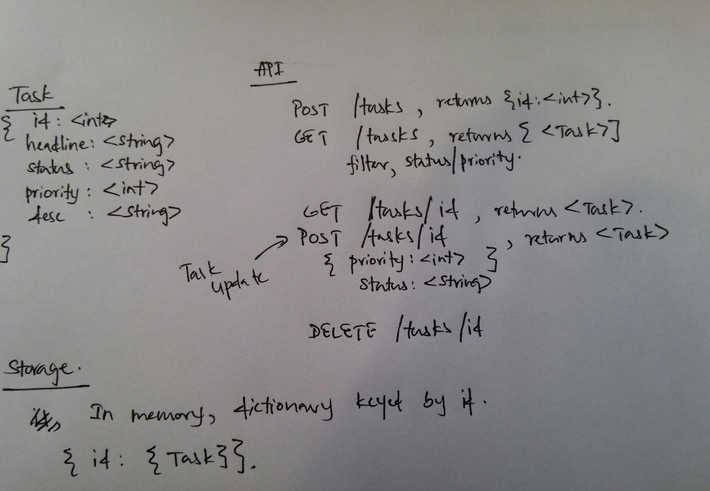

# Rest API in Flask


In order to understand how to design REST API's in Flask, Let's work on a simple example. Let's not worry about authentication or having multiple user accounts in this example. Let's create a simple TODO app where you can keep track of TODO items. For simplicity we will not deal with database part for now. All data for this application will be in the memory. I have worked out a simple design for this app in a paper.

## Part 01
Let's start with something simple. Lets define tasks API as follows as a begining.

```python
from flask import Flask
app = Flask(__name__)

@app.route('/tasks')
def tasks():
    return 'Hello World!'

if __name__ == '__main__':
    app.run()
```

## Part 02
In order to consume this service, we can use following client. Also, you can write your own client using language of your choice or curl.

```python
import requests

def main():
    res = requests.get('http://localhost:5000/tasks')
    print (res.text)

if __name__ == '__main__':
    main()
```


First go ahead an start server in one terminal, in another terminal use client to access the server. If server starts properly, you could see an output similer to above output.

Lets go ahead and implement function to create tasks. Task entity is defined as follows.

```
Task
{
    id: <int>,
    headline: <string>,
    status: <string>,
    priority: <int>,
    description: <string>,
}
```

```
POST /tasks
returns Task
```

First I have updated client to send JSON request to the service as follows.

```python
import requests
import json

def main():
    data = {'headline': 'task 01', 'description': 'Adding first task'}
    headers = {'Content-Type': 'application/json'}
    res = requests.post('http://localhost:5000/tasks', headers=headers, data=json.dumps(data))
    print (res.text)

if __name__ == '__main__':
    main()

```

In order to serve above request, I updated services as follows.

```python
from flask import (Flask, request, jsonify)
app = Flask(__name__)

config = {}
config['tasks_id'] = 0
config['tasks'] = {}

@app.route('/tasks', methods=['GET', 'POST'])
def tasks():
    if request.method == 'POST' and request.headers['Content-Type'] == 'application/json':
        headline = request.json.get('headline', None)
        description = request.json.get('description', None)
        status = request.json.get('status', 'open')
        priority = request.json.get('priority', 3)
        if headline is None:
            return jsonify(result=dict(status='fail', description='Task headline not found'))
        config['tasks_id'] += 1
        config['tasks'][config['tasks_id']] = dict(id=config['tasks_id'], headline=headline, description=description, status=status, priority=priority)
        return jsonify(result=dict(status='success', data=config['tasks'][config['tasks_id']]))
    return 'Hello World!'

if __name__ == '__main__':
    app.run(debug=True)

```
As in the first step, run server in one terminal and send request from client in another terminal.


## Part 03
Keep in mind that we have all of these tasks/data in memory. Everytime server restarts we loose our data. We use this design just to get an exposure to REST api development. Now let's go ahead and add GET function implementation in tasks. 

```
GET /tasks
return [<Tasks>]
filters status, priority
```

It will return array of tasks. Also, we should be able to filter them based on task status and priority. I have updated client as follows

```python
import requests
import json

def main():
    data = {'headline': 'task 01', 'description': 'Adding first task'}
    headers = {'Content-Type': 'application/json'}
    res = requests.post('http://localhost:5000/tasks', headers=headers, data=json.dumps(data))
    print (res.text)
    res = requests.get('http://localhost:5000/tasks')
    print (res.text)

if __name__ == '__main__':
    main()
```

From the services, we have only one line change to get the tasks in memory.
Only change we did, was in tasks function, therefore I will update only that.

```python
@app.route('/tasks', methods=['GET', 'POST'])
def tasks():
    ...
    ...
    return jsonify(result=dict(status='success', data=list(config['tasks'].values())))

```


## Part 04

Let's move on to implement individual task URI's. After creating a tasks we will have task id. Let's use taks id to get information about task. My client implementation is shown below.

```python
def main():
    data = {'headline': 'task 01', 'description': 'Adding first task'}
    headers = {'Content-Type': 'application/json'}
    res = requests.get('http://localhost:5000/tasks/1')
    print (res.text)
```

Remember, we don't have a service implementation for this one yet. However let's run client and see what happens.


Move on to add, service implementation.

```python
@app.route('/tasks/<int:id>')
def task(id):
    task = config['tasks'].get(id, None)
    if task is None:
        return jsonify(result=dict(status='fail', data=None))
    return jsonify(result=dict(status='success', data=config['tasks'][id]))

```

Test this new service implementation after adding few tasks into memory. If you don't have any tasks in memory, you will get something like below.


Otherwise if requested a tasks in memory, you will get a valid task


## 05 Part - Updating tasks

Now, we have tasks in memory, lets work on updating task using REST API. For update we can either use PUT or POST. I would like to use POST in this implementation. If you want to use PUT, you can just add PUT in methods. As we did before, first create a client.

```python
def main():
    headers = {'Content-Type': 'application/json'}
    data = {'headline': 'task 01', 'description': 'Updated task description for first test'}
    res = requests.post('http://localhost:5000/tasks/1', headers=headers, data=json.dumps(data))
    print (res.text)
```

As you might have expected, this client should throw an error as we don't have a service implementation yet.


Let's go ahead and add service implementation for this client request.

```python
@app.route('/tasks/<int:id>', methods=['GET', 'POST'])
def task(id):
    task = config['tasks'].get(id, None)
    if task is None:
        return jsonify(result=dict(status='fail', data=None))

    if request.method == 'POST' and request.headers['Content-Type'] == 'application/json':
        headline = request.json.get('headline', None)
        description = request.json.get('description', None)
        status = request.json.get('status', None)
        priority = request.json.get('priority', None)

        if headline is not None:
            task['headline'] = headline
        if description is not None:
            task['description'] = description
        if status is not None:
            task['status']  = status
        if priority is not None:
            task['priority'] = priority

        config['tasks'][id] = task

        return jsonify(result=dict(status='success', data=task))
    return jsonify(result=dict(status='success', data=config['tasks'][id]))

```

Now let's see, the response we got.


## Part 06 - Delete a task

Now we are in the final part of the api. Let's go ahead and delete a task we have. As we did before write a client first.

```python
def main():
    headers = {'Content-Type': 'application/json'}
    res = requests.delete('http://localhost:5000/tasks/1', headers=headers)
    print (res.text)

```
Also, as we saw previous parts we will get a "Method Not Allowed" error. That's OK. Let's go ahead and add service to delete a taks.

```python
@app.route('/tasks/<int:id>', methods=['GET', 'POST', 'DELETE'])
def task(id):
    task = config['tasks'].get(id, None)
    if task is None:
        return jsonify(result=dict(status='fail', data=None))

    if request.method == 'POST' and request.headers['Content-Type'] == 'application/json':
        headline = request.json.get('headline', None)
        description = request.json.get('description', None)
        status = request.json.get('status', None)
        priority = request.json.get('priority', None)

        if headline is not None:
            task['headline'] = headline
        if description is not None:
            task['description'] = description
        if status is not None:
            task['status']  = status
        if priority is not None:
            task['priority'] = priority

        config['tasks'][id] = task
        return jsonify(result=dict(status='success', data=task))
    elif request.method == 'DELETE' and request.headers['Content-Type'] == 'application/json':
        del config['tasks'][id]
        return jsonify(result=dict(status='success', data=None))

    return jsonify(result=dict(status='success', data=config['tasks'][id]))

```

You can see the output here

## Next Tutorials
We will use same API we developed here for following tutorials.
* Using SQLAlchemy with Flask
* Test driven development with Flask.